# VariantSpark on AWS Marketplace

[Link to VariantSpark on Marketplace](https://aws.amazon.com/marketplace/pp/AEHRC-VariantSpark-Notebook/B07YVND4TD)

Installing and configuring a computer cluster with all required software is a complicated and time-consuming task. The VariantSpark module on AWS Marketplace is made to simplify the process. It creates an AWS EMR computer cluster and provide user with the link to a Jupyter notebook, baked by the cluster. The cluster is preconfigured with VariantSpark and Hail installed and an example notebook to help you build your own pipeline. This document includes:

- A detailed specification of what is created by this module is provided in _Specification_.
- A step-by-step guide with screenshots is provided for user in _Step by Step Guide to Use VariantSpark Marketplace Module_.

VariantSpark AWS Marketplace module is based on the VariantSpark CloudFormation template available on [GitHub](https://github.com/aehrc/VariantSpark-aws). CloudFormation templates allow to code AWS infrastructures. We strongly recommend using the VariantSpark marketplace module as there has been several improvements compared to CloudFormation templates available in GitHub. **Note that the user should pay for all AWS resources but the VariantSpark is provided free of charge for now.**

We use the word &quot;template&quot; and &quot;stack&quot; to refer to VariantSpark CloudFormation template available through AWS marketplace and the resulting CloudFormation stack, respectively. A stack is a set of AWS resources and configurations managed by CloudFormation.

## Specification

There are five parameters that the user should set for the template (see _Figure 6_):

- Number of worker CPUs in the cluster.
- The IP address (or range) which can access the cluster.
- Whether the user would like to benefit from AWS Spot pricing (suitable for research purpose).
- The key for low level access to cluster
- The IP address range for compute nodes in the cluster.

### Hardware

The main resource in the resulting stack is an AWS EMR computer cluster. EMR uses AWS EC2 computers for both the master and worker (core) nodes in the cluster. There are two different hardware configurations for an EMR cluster: Uniform Instance Group and Instance Fleet. Our stack uses Instance Fleet configuration where the core nodes are selected by the AWS from a set of specified EC2 instances. In case one instance type is not available AWS automatically uses other available instance types. The following instance type are used in the cluster:

|  Node Type   | Instance Type | # CPU (Virtual CPU) | Memory (GB) | DISK |
| :----------: | :-----------: | :-----------------: | :---------: | :--: |
|    MASTER    |   r4.xlarge   |          4          |    30.5     |  32  |
| CORE(Worker) |  r4.2xlarge   |          8          |     61      |  64  |
| CORE(Worker) |  r4.4xlarge   |         16          |     122     | 128  |
| CORE(Worker) |  r4.8xlarge   |         32          |     244     | 256  |
| CORE(Worker) |  r4.16xlarge  |         64          |     488     | 512  |

Other EMR configurations are described in _Figure 1_ and _Figure 2_.

Other generated resources include:

- An AWS S3 bucket to hold the bootstrap script, EMR logs and Jupyter notebook directory. **Important Note:** The S3 bucket remains persistent and is not deleted when you delete the stack. This is because the user may save the modified notebook and data file in the S3 bucket which should be preserved. If you try it for test you should delete the S3 bucket yourself after you delete the Stack.
- A small EC2 instance (t3a.nano) for billing purpose. It also used in the software configuration process.
- An AWS VPC and Subnet (as well as other network related resources) to create the EMR and other resources inside the network.
- A set of AWS Security Groups and AWS Roles to allow access EMR cluster only through specified IP address range as well as some other security measure.

Note that you also need an AWS EC2 Keypair which you should manage it yourself.

### Software

The most up to date VariantSpark marketplace product uses **emr-5.27.0** with **spark-2.4.4** and **Ganglia-3.7.2** as a base software configuration. Other EMR software configuration are done using the bootstrap action (script) which should be stored in the S3. CloudFormation copies the bootstrap into a the corresponding S3 bucket (see _Figure 18_). The Bootstrap does not install any software from source. This is Due to the AWS policy that no external material should be downloaded during initialisation of marketplace products. It helps to maintain marketplace products functional and independent of external changes. Instead, the bootstrap copies pre-compile and pre-configured required software from monitor instance to the master node. All binaries are hard-coded in the monitor instance image (AWS AMI). The bootstrap action performs the following actions:

- Install
  - Python 3.6 and relevant Python packages installed via conda
  - Jupyter Notebook
  - Hail v0.2
  - VariantSpark
- Initiate a Jupyter notebook server on port 8888 with no password.
- Set the Jupyter notebook path to the corresponding S3 bucket
- Copy example notebook to the corresponding S3 bucket

## Step by Step Guide to Use VariantSpark Marketplace Module

Note that you should have an AWS account with required permission to follow this tutorial. First login to your AWS account and then follow below steps.

1. Go to [VariantSpark AWS Marketplace website](https://aws.amazon.com/marketplace/pp/AEHRC-VariantSpark-Notebook/B07YVND4TD). Ignore the sample pricing for t3a.nano EC2 instance. You will be charged by AWS for the resources described above. Click &quot;Continue to Subscribe&quot;.

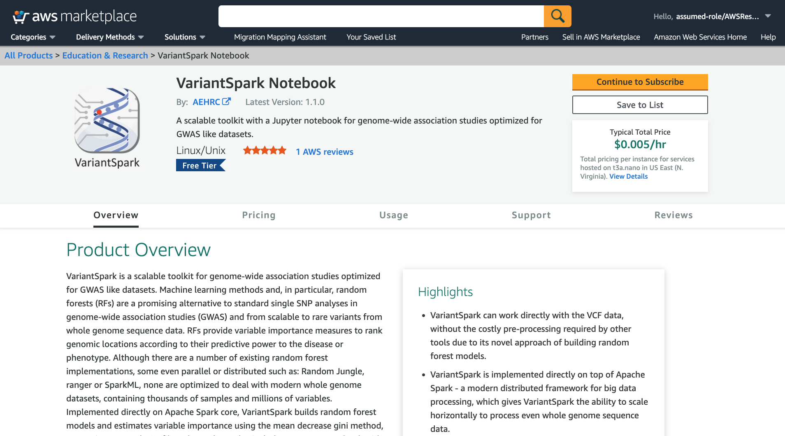

_Figure 1: VariantSpark AWS Marketplace_

2. Click &quot;Continue to Configure&quot;

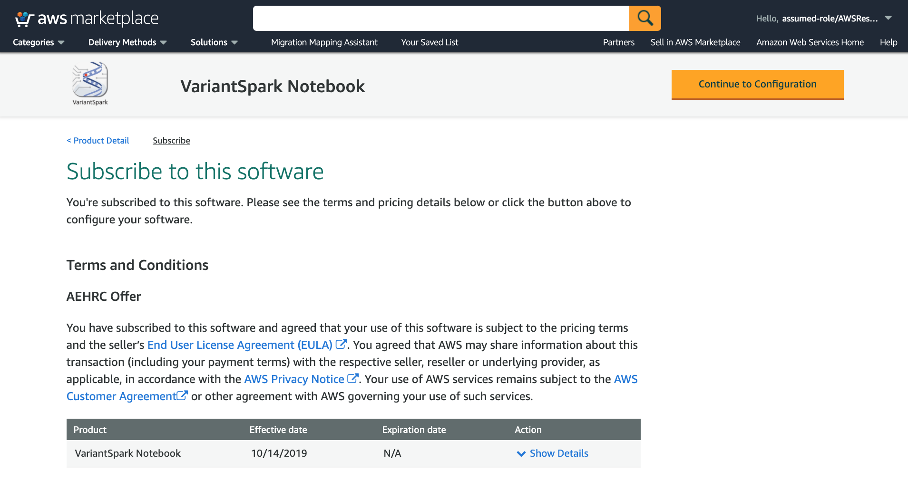

_Figure 2: Configure Marketplace_

3. Select the AWS Region you would like to allocate resources in. Currently there are two version of this Marketplace product. The older version comes with Hail v0.1. Select the Software version and click &quot;Continue to Lunch&quot;

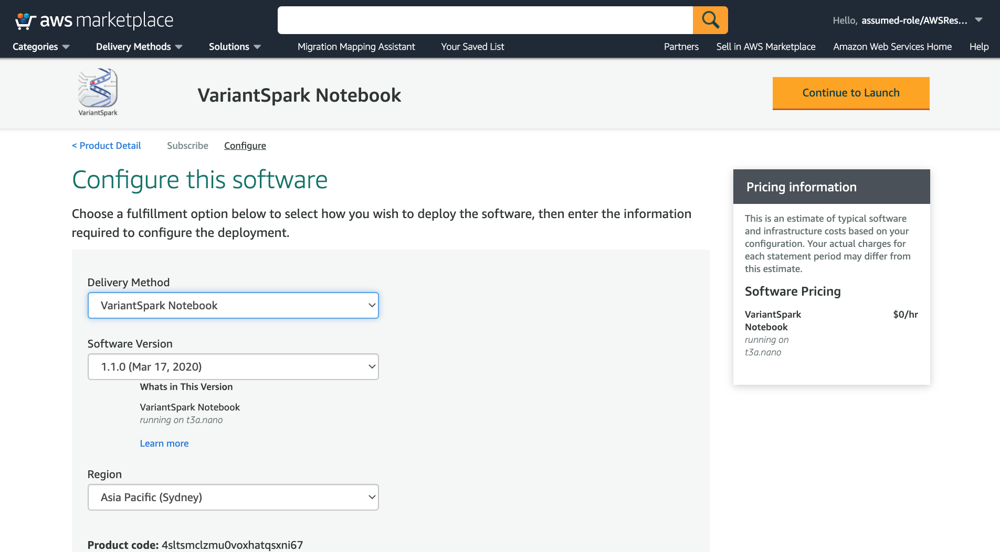

_Figure 3: Lunch Marketplace_

4. Choose &quot;Lunch CloudFormation&quot; in the Action dropdown menu and click &quot;Lunch&quot;

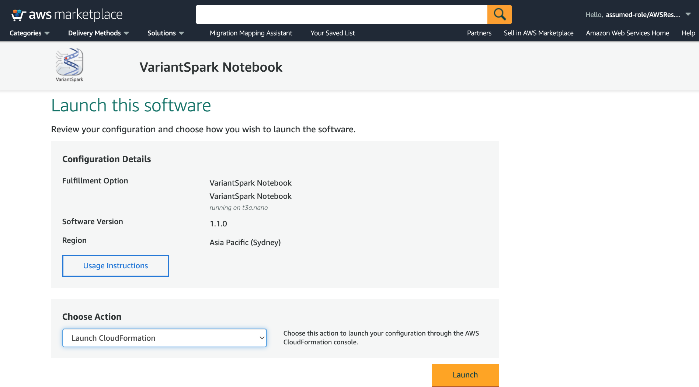

_Figure 4: Lunch Template_

5. You are redirected to the CloudFormation console with the loaded template. Click &quot;Next&quot;

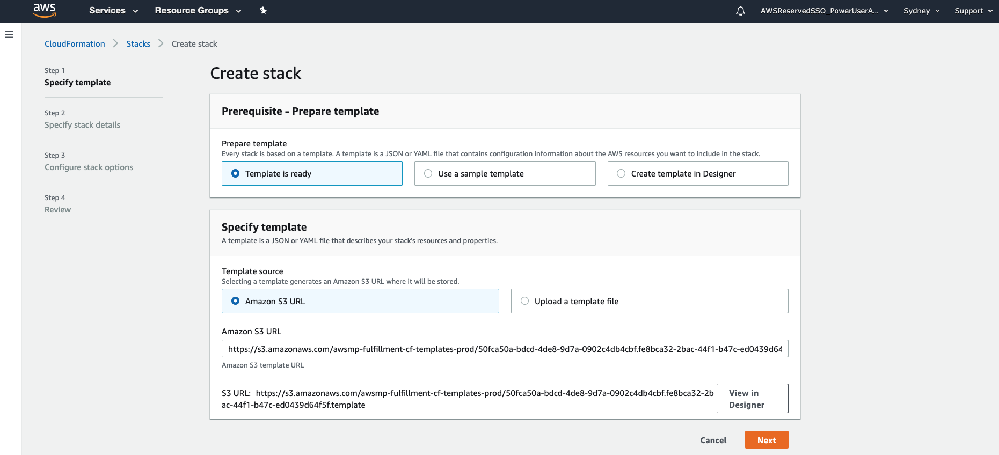

_Figure 5: VariantSpark CloudFormation Template_

6. Here you should specify a name for your stack and pass the parameter to the template. Note that AWS allocate enough number of r4 EC2 instances to meet the requested number of CPU but the actual number of allocated CPU could be more that the input specifically if the number of CPU is not module of 8 (minimum number of CPU in an instance). The &quot;IncomingAddressWhitelist&quot; allow a range of IP (v4) addresses to access the cluster. There are number of websites which can give you your IP (v4) address (i.e. [https://whatismyipaddress.com/](https://whatismyipaddress.com/)). For test purpose add &quot;/32&quot; to the end of your IP address to limit it to your IP address. The VpcCrdiBlock define the internal IP address range for the cluster. The default value allow to address about 250 devices which is sufficient even for a large computer cluster. EC2KeyPair are used to remote access (SSH) to the individual computers in the cluster. You do not need this to access the Jupyter notebook on port 8888 of the master node. Once you get into the Jupyter you can create a web-based terminal to the master node without SSH. Once you entered parameters, click &quot;Next&quot; twice to get into step 4 (se left side navigation bar).

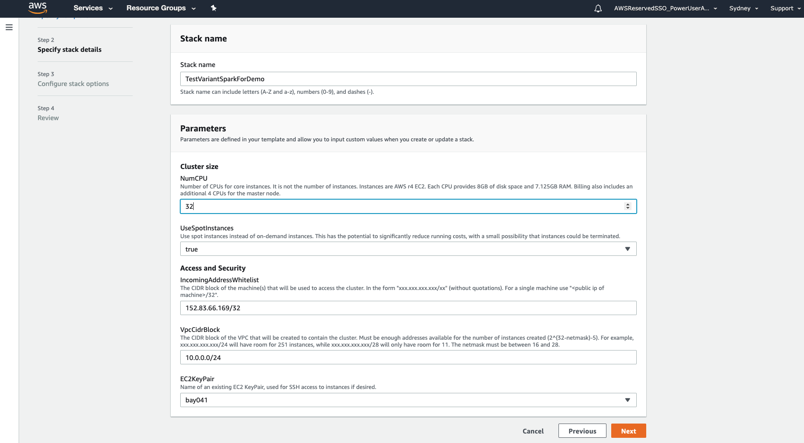

_Figure 6: CloudFormation Parameters_

7. Check the acknowledgement box and click &quot;Create Stack&quot;

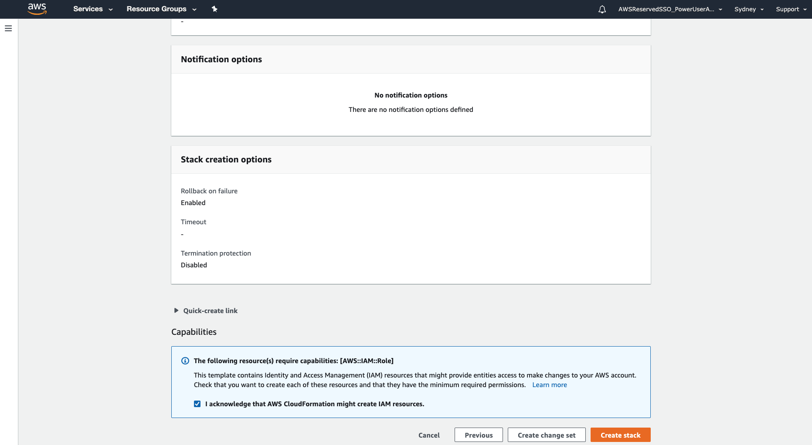

_Figure 7: Create Stack_

8. You will be directed to the stack management console with your stack in the &quot;CREATE_IN_PROGRESS&quot; status selected on the left panel.

_Figure 8: Creation in Progress_

9. You can monitor all events in the &quot;Events&quot; tab of your stack till the the stack status turns to &quot;CREATE_COMPELETE&quot;

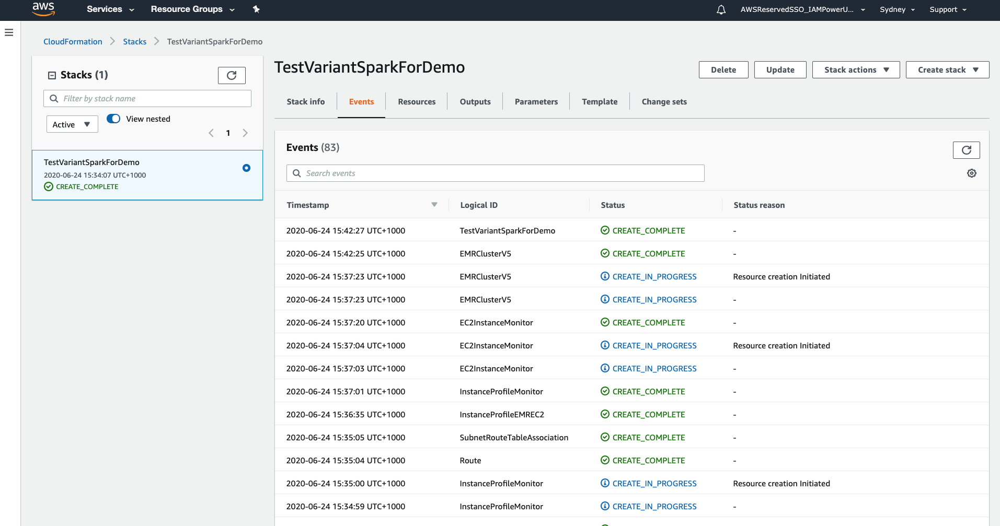

_Figure 9: Creation Completed_

10. In the &quot;Stack info&quot; tab you can see a brief summary of your stack.

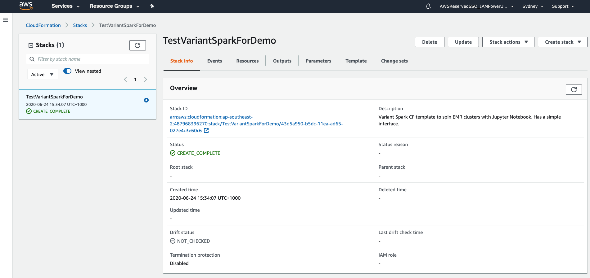

_Figure 10: Stack Info_

11. In the &quot;Resource&quot; tab you can see the list of all resources in the stack and its creation status.

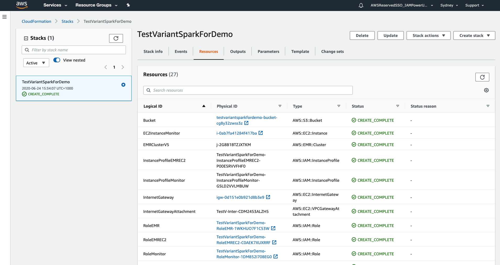

_Figure 11: Stack Resources_

12. You can verify your input parameter in the &quot;Parameter&quot; tab

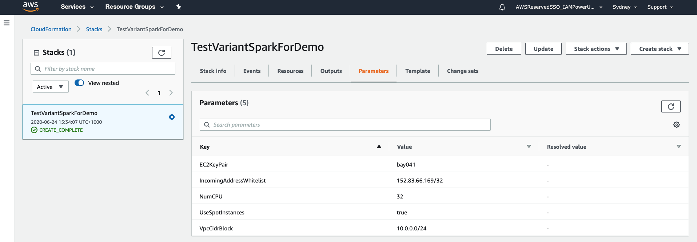

_Figure 12: Stack Parameters_

13. The most important that is the output where we collect a set of important information for the user. Most importantly, the link to the Jupyter that is the port 8888 of the public DNS of the master node. Secondly, the link to the S3 buckets that holds all your notebook as well as EMR configuration data. The deletion of the stack does not delete the S3 bucket. User should manually delete the S3 bucket if it has no use. The link to the Ganglia where you can monitor resource utilisation of your EMR cluster. And the link to the cluster in the EMR console.

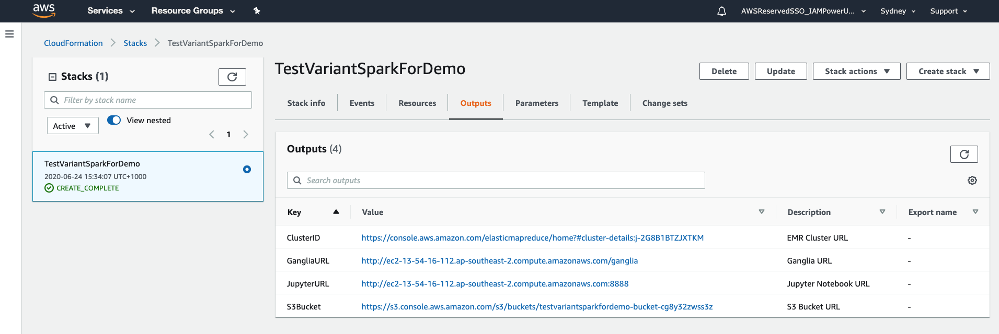

_Figure 13: Stack Output_

14. The EMR console gives you a brief summary of your cluster. If you are familiar with AWS EMR, you may clone your cluster to have fine-tune control in EMR cluster configuration.

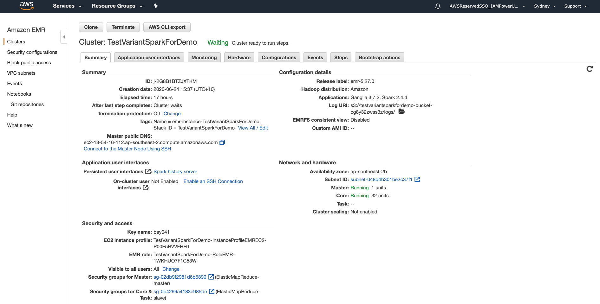

_Figure 14: EMR Summary_

15. In the &quot;Bootstrap actions&quot; tab you can see the path to the bootstrap file which is located in the S3 bucket. It has the details of all software installed on the cluster.

_Figure 15: EMR Bootstrap_

16. The &quot;Configuration&quot; tab list advanced parameter settings of the EMR cluster.

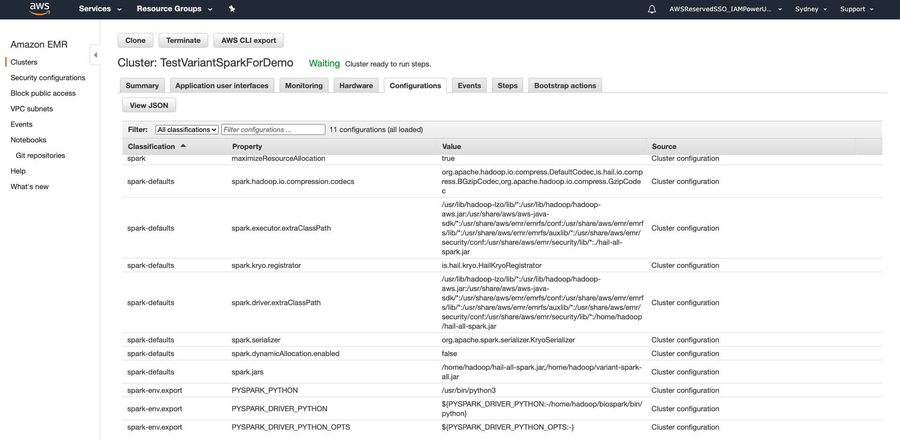

_Figure 16: EMR Configurations_

17. The top two plots in the Ganglia shows the CPU and memory usage of the whole cluster (from left to right respectively). This is particularly helpful to identify the size of the cluster you need for your job done. If the Memory utilisation goes beyond 80% of your memory it is recommended to use a bigger cluster (more worker CPU in the template parameter). The CPU utilisation helps to find out if your pipeline is hanging or in progress.

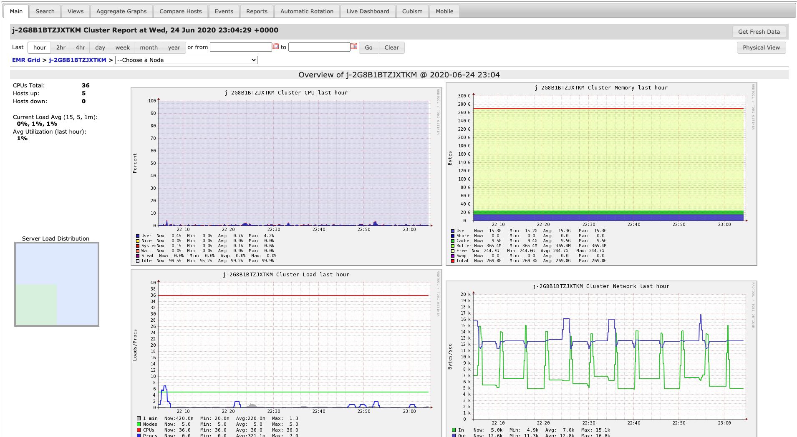

_Figure 17: EMR Ganglia_

18. Here is how S3 bucket looks like. You can upload your data or download your saved notebook. Note that when you create a new notebook it does not save it in the local storage of the master node but in this S3 bucket to be persitant.

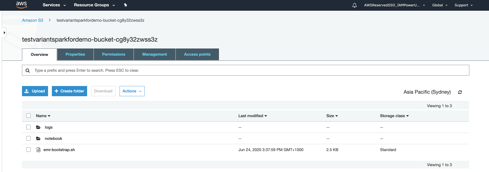

_Figure 18: S3 Bucket_

19. An example notebook is copied into your notebook directory.

_Figure 19: Jupyter Notebook_

20. It contains the basic instruction how to use Hail and VariantSpark

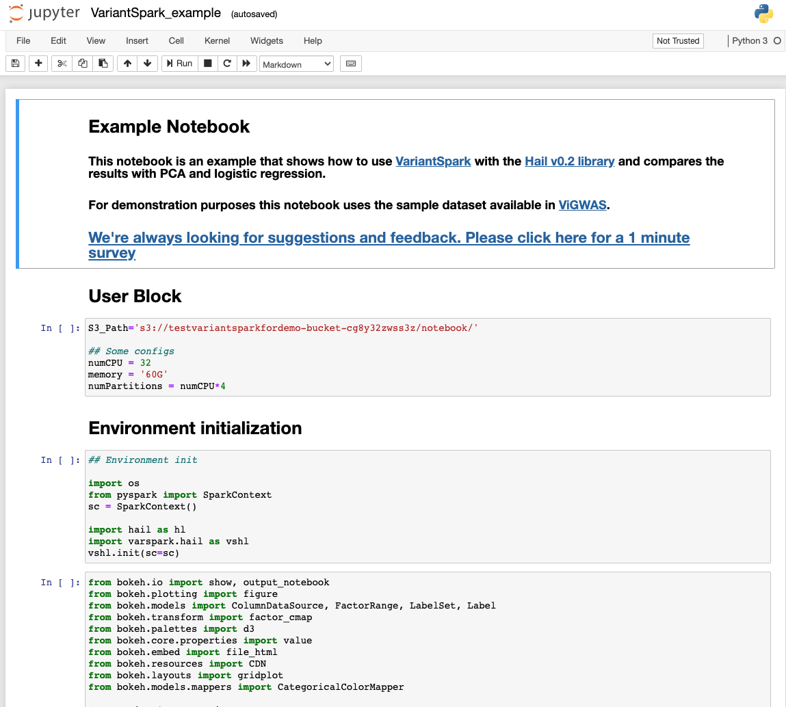

_Figure 20: Example Notebook_

21. Run all cells in the notebook.

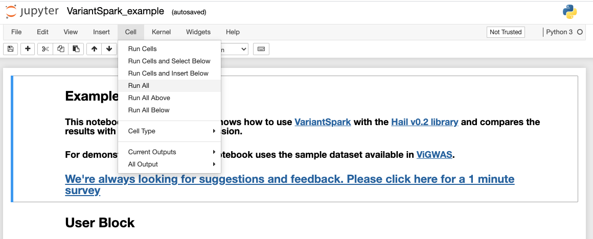

_Figure 21: Run Example_

22. The notebook creates a Manhattan plot of Variable Importance computed buy VariantSpark.

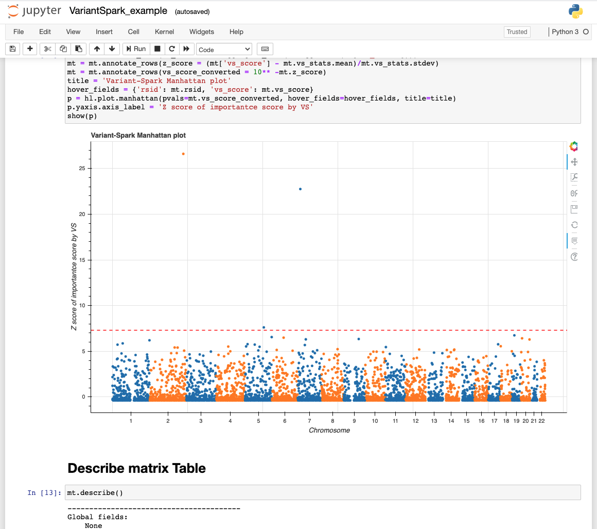

_Figure 22: Example Output_

23. If you check the Ganglia after running the notebook you can measure how much compute resources have been used.

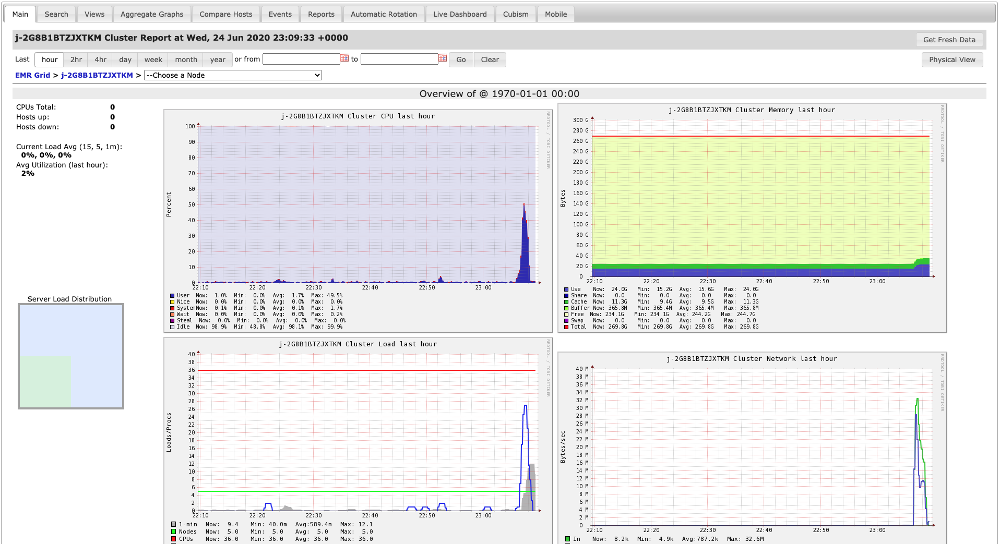

_Figure 23: Ganglia Shows the Example Workload_

24. Once you finish whit the stack you should delete it. Note that you will continue to pay for AWS resources even if you don&#39;t use them.

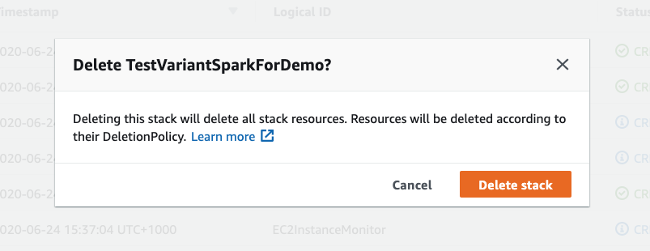

_Figure 24: Confirm Stack Deletion_

25. The deletion may take a few minutes to be completed.

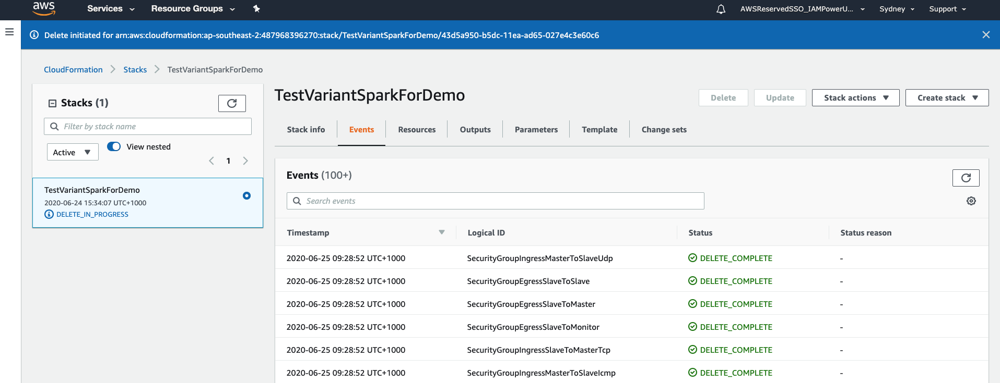

_Figure 25: Deletion in Progress_

26. Wait until the stack status turns to &quot;DELETE_COMPELETED&quot;. Make sure that all resources are deleted. Delete the S3 bucket if it has no longer use to you.

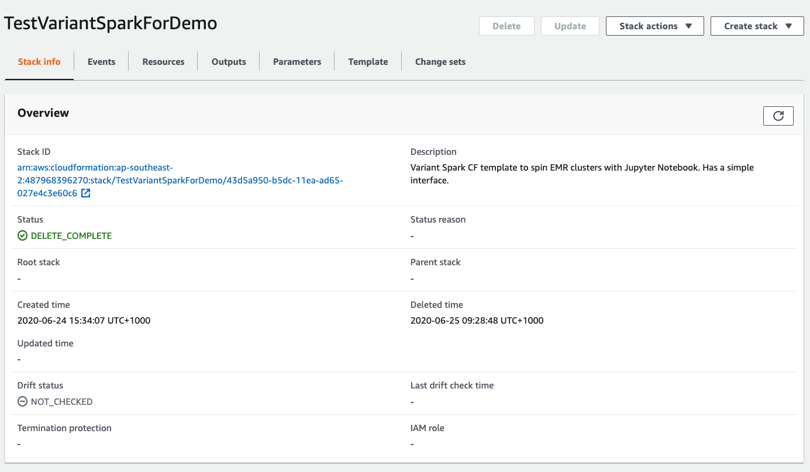

_Figure 26: Deletion is completed_
